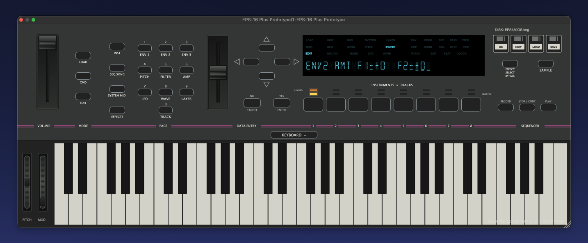
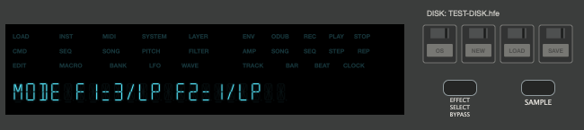

# Ensoniq EPS-16 Plus VST3 Emulator

Hardware-level emulation of the Ensoniq EPS-16 Plus sampler for Apple Silicon
Macs, built as a resizable VST3 instrument.



## 1.0.1 Beta bug-fix release

- Presets saved while a MIDI key was held no longer restore that key as an
  unreleaseable playing note.
- Existing affected presets remain compatible. Snapshot versions 1–4 are
  repaired automatically during restore by releasing the external keyboard
  through the original KPC/OS event path.
- Instruments, sample RAM, effects, display state and mounted disks remain
  part of the complete preset and DAW-project state.

## About the EPS-16 Plus

The EPS-16 Plus is a performance sampler whose character comes from much more
than its sample memory. Its pitch interpolation, voice architecture, filters,
loop modes, modulation, envelopes, effects, sampling path and original
operating system all contribute to the way the instrument feels and sounds.

This project does not replace that workflow with a modern sample player. It
recreates the hardware around the original Ensoniq software: the Motorola
68000 program, keyboard/panel controller, ES5505 voice chip, ES5510 effects
processor, floppy controller, display and audio paths are presented to the
unaltered EPS operating system.

The original EPS OS remains in charge. A click in the GUI becomes the same
kind of hardware event as a physical button press; the emulator does not infer
menus from text or bypass the sampler's own logic.

## Download

### [Download EPS-16 Plus Prototype 1.0.1 Beta — macOS arm64 VST3](release/EPS-16-Plus-Prototype-arm64.zip)

SHA-256:
`28c6dc22a2ed4e3bad139c072814ef404ccb549c1e482ee750182b39b5d74e42`

This build requires an Apple Silicon Mac, macOS 11 or newer and a VST3-capable
DAW. It contains **VST3 only**; no Audio Unit is included.

> **Original Ensoniq files are required.** ROM, KPC firmware and operating
> system disk images are copyrighted and are not included in this repository
> or download.

## What is working?

- The original EPS-16 Plus ROM, operating system and KPC panel firmware paths.
- Authentic 22-cell Futaba-style VFD, indicators, decimal points and
  OS-controlled cursor segments.
- ES5505 sample voices with hardware interpolation, looping, envelopes,
  panning, four-pole filtering and per-voice behavior.
- ES5510 effects and routing, including repeated switching between ROM effects
  10, 11, 12 and 13 and Waveboy external-input programs.
- LINE sampling and the modeled MIC preamp/input filter, with recording and
  audible playback controlled by the original OS.
- Eight instruments/tracks, layers, wavesamples, stacking and the original
  front-panel editing workflow.
- MIDI notes and velocity, Pitch Wheel, Mod Wheel and channel-1 polyphonic
  aftertouch delivered through the appropriate emulated hardware paths.
- Original EPS sequencer controls. Ableton tempo, Start, Continue and Stop can
  drive the EPS through MIDI Clock when `CLOCK SOURCE=MIDI` is selected.
- Independent plug-in instances and complete DAW project/preset restore,
  including sample RAM, instruments, effects, display/parser state and mounted
  disk.
- EPS floppy images: insert IMG or HFE, swap multiple disks, create a blank
  disk and save as IMG or hardware-compatible HFE.
- Resizable, hardware-inspired panel with mouse-operated Data Entry, volume,
  arrow keys and original button layout.



## Installation

1. Quit the DAW and unpack the ZIP.
2. Copy `EPS-16 Plus Prototype.vst3` to:

   ```text
   ~/Library/Audio/Plug-Ins/VST3/
   ```

3. Copy the included `EPS_files` folder beside the VST3 bundle.
4. Add your own legally obtained files to `EPS_files`:

   ```text
   eps16plus-rom.bin   combined 128 KiB U28/U27 main ROM
   eps16plus-kpc.bin   32 KiB KPC 2.33 EPROM
   EPS130OS.img        819,200-byte EPS-16 Plus OS disk
   ```

   `EPS130OS.hfe` is also accepted. The original filename
   `Ensoniq EPS KPC2 v2.33 27c256.BIN` is recognized without renaming.

5. Start the DAW, rescan VST3 plug-ins and insert the emulator as an
   instrument. A successful boot normally reaches `NO INSTRUMENTS`.

The resulting layout should be:

```text
~/Library/Audio/Plug-Ins/VST3/
  EPS-16 Plus Prototype.vst3
  EPS_files/
    eps16plus-rom.bin
    eps16plus-kpc.bin
    EPS130OS.img
```

The original EPS-16 Plus manual remains the reference for sampling,
instruments, layers, wavesamples, loops and synthesis.

## Audio and MIDI

Load the plug-in on a MIDI instrument track. MIDI notes 36–96 play the
virtual 61-key EPS keyboard. Notes outside the physical keyboard range are
ignored.

Pitch Wheel and Mod Wheel feed the original global controller inputs. The EPS
is not an MPE instrument: member-channel MPE expression is deliberately not
translated into invented EPS functions. Standard Note On/Off remains on the
direct, stable keyboard path.

When the plug-in window has keyboard focus, the computer arrow keys operate
the four physical EPS arrow buttons. Use Left/Right to move between menu pages
or fields and Up/Down to change the value selected by the original OS. The
keys are not captured when another window has focus.

The plug-in provides a stereo main output and an additional stereo
`Sampling Input`. In Ableton Live, route audio to that input with the
plug-in's input/sidechain chooser. MIC/LINE selection, threshold, input filter,
recording and sample assignment are still performed on the EPS panel through
the original OS.

## Sequencer sync

The GUI exposes the original `RECORD`, `STOP / CONT` and `PLAY` buttons.
Recording on the hardware requires holding RECORD while pressing PLAY; in the
plug-in use **Shift-click on PLAY** for the same overlapping button gesture.

Ableton tempo and transport are serialized as standard MIDI realtime bytes and
received by the emulated EPS MIDI hardware. Select `CLOCK SOURCE=MIDI` inside
the EPS to follow the DAW. With `INTERNAL`, the EPS continues to use its own
clock.

## Floppy controls

The four small disk buttons are emulator media controls. They do not replace
the large original EPS `LOAD` mode button.

| Button | Action |
| --- | --- |
| `OS` | Reinsert the configured EPS operating-system disk. |
| `NEW` | Insert a freshly formatted blank 800 KiB EPS disk. |
| `LOAD` | Insert an existing IMG or HFE v1 disk image. |
| `SAVE` | Export the mounted disk, including OS-written changes, as IMG or HFE. |

Use IMG for convenient backups and emulator interchange. Use HFE when the
disk is intended for a compatible Gotek/HxC setup or real EPS hardware.
Each plug-in instance owns an independent virtual drive. The mounted media
name is shown above the four disk icons.

## Presets, projects and multiple instances

Saving the DAW project captures the full running machine state: CPU and OS
state, instruments, sample RAM, effects, display, controller state and mounted
disk. Reopening the project can therefore continue from the same point.

This does not replace the disk `SAVE` command when a separate disk image is
needed outside the DAW project. ROM and OS files are never embedded in the
project state.

## Known limitations

- This is a **1.0.1 Beta** build for Apple Silicon macOS only.
- VST3 only; no AU is shipped.
- The bundle is ad-hoc signed but not Apple-notarized. macOS may require
  explicit approval in Privacy & Security.
- The original EPS has no MPE voice-expression model.
- There is intentionally no modern host-side parameter editor or sample
  browser. The original OS, panel workflow and EPS manual remain authoritative.
- Copyrighted Ensoniq ROM, KPC and OS files must be supplied by the user.

## Validation

The 1.0.1 Beta package is built and checked as an arm64 VST3, ad-hoc signed,
strictly code-sign verified and ZIP-tested. Automated and original-OS
regressions cover:

- LINE and MIC sampling, threshold movement, recording and audible playback;
- VFD fields and cursor segment masks;
- ES5510 effects 10–13 and audio-bus routing;
- Pitch Wheel, Mod Wheel, MIDI pressure transport and Note Off;
- sequencer RECORD/PLAY/STOP and DAW-clock serialization;
- IMG/HFE I/O, disk swapping and blank-disk creation;
- snapshot compatibility, VST state and three independent instances;
- absence of illegal 68000 instructions in the tested workflows.

## Project and technical documentation

This repository also contains the clean-room reverse-engineering and test
foundation used to build the plug-in:

- [VST3 architecture and build notes](docs/vst3-prototype.md)
- [Hardware and original-OS bring-up](docs/bringup.md)
- [Panel/KPC protocol](docs/panel-protocol.md)
- [Parameter and ownership mapping](docs/parameter-mapping.md)
- [KPC firmware reference](docs/kpc-reference.md)

The disk tools can decode HFE v1, validate MFM sectors and CRCs, rebuild the
logical 800 KiB EPS image, inspect the Ensoniq filesystem and create
hardware-compatible HFE output. Development builds use the external
[Musashi](https://github.com/kstenerud/Musashi) 68000 core and JUCE; no
copyrighted Ensoniq binaries are stored in the source tree.

## Credits and third-party work

- [Musashi](https://github.com/kstenerud/Musashi), by Karl Stenerud, executes
  the Motorola 68000 code. The VST3 build applies a small thread-local
  adaptation at build time so independent plug-in instances can run safely.
- [JUCE 8](https://github.com/juce-framework/JUCE), by Raw Material Software,
  provides the VST3 wrapper, DAW audio/MIDI integration, plug-in state,
  windowing and GUI framework.
- [MAME](https://github.com/mamedev/mame) is **not** embedded as the emulator
  framework. Its Ensoniq drivers and device implementations were valuable
  hardware/protocol references. The standalone ES5510 execution core adapts
  pipeline and instruction semantics from the BSD-3-Clause MAME ES5510 device
  by Christian Brunschen.
- The Ensoniq EPS-16 Plus service manual, legally supplied firmware/disk
  images, real hardware photographs and captured OS/KPC traffic were used to
  verify mappings and behavior. Those copyrighted Ensoniq files are never
  distributed by this project.

See [THIRD_PARTY_NOTICES.md](THIRD_PARTY_NOTICES.md) for attribution and
license details. The same notices are included in the downloadable package.

## Build

Place JUCE 8 at `work/deps/JUCE` and Musashi at `work/deps/Musashi`, then:

```sh
cmake -S . -B work/vst3-build \
  -DEPS16_BUILD_VST3=ON \
  -DEPS16_JUCE_DIR="$PWD/work/deps/JUCE" \
  -DCMAKE_BUILD_TYPE=Release \
  -DCMAKE_OSX_ARCHITECTURES=arm64

cmake --build work/vst3-build --target eps16_vst3_package -j 8
ctest --test-dir work/vst3-build --output-on-failure
```

The package target creates a verified VST3 archive without building or
shipping an Audio Unit.
